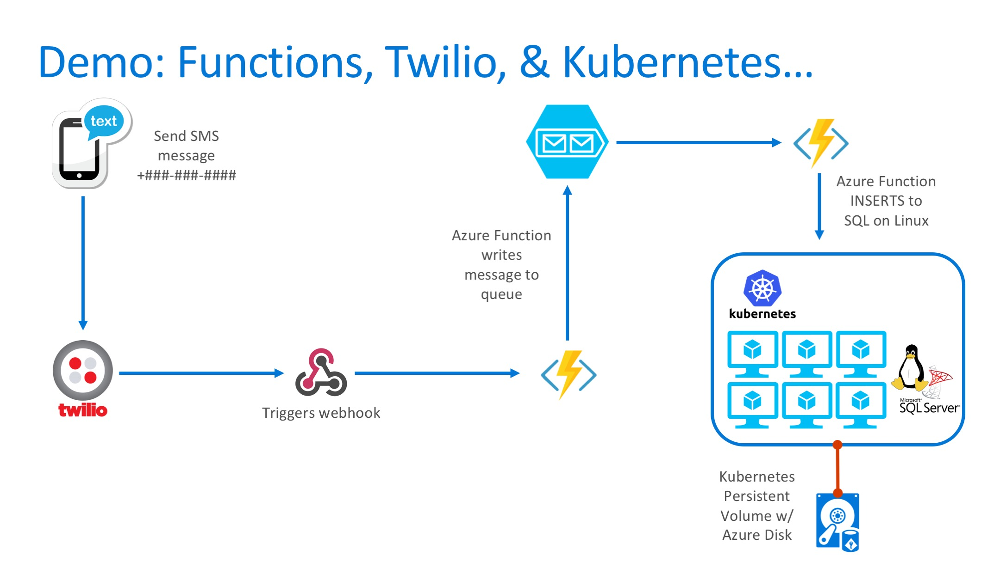

# SQL Guestbook
This is a simple SQL Server on Linux Docker example with a .NET Core web front-end. Can also run this in Azure PaaS services.



## Demo Pre-requisites

This application combines Azure Functions with Twilio, Azure queues, Cognitive Services and posts data to databases such as SQL Server on Linux. Kubernetes example provided. Below items must be setup in advance:

* Twilio account and setup: [Azure webhook details here](https://www.twilio.com/docs/guides/serverless-webhooks-azure-functions-and-csharp#create-a-new-azure-function-app)
* Azure storage queue
* Azure Container Services Kubernetes cluster
* Cognitive Services Account

## Setup Instructions

### Azure Functions

* Twilio trigger -> Azure Queue (fx_queuetrigger)
  * Configure Azure Cognitive Text Analytics API
  * Provide URL and key in code (need to add to environment varible)
* Azure Queue -> SQL Databases (fx_queuetosql)
  * Parses data from queue
  * Writes to SQL Azure, SQL on Linux, or CosmosDB depending on toggle flags in environment variables
    * SQL_AZURE_IP
    * SQL_AZURE_ID
    * SQL_AZURE_PWD
    * SQL_AZURE_DB
    * K8S_SQL_IP
    * K8S_SQL_ID
    * K8S_SQL_PWD
    * K8S_SQL_DB
    * TOGGLE_SQL_AZURE
    * TOGGLE_K8S_SQL
    * TOGGLE_COSMOS_DB
  * Plan to add code for CosmosDB in the future

### Web

* Simple .NET web app that displays guestbook entries
* Build using provided Dockerfile
* Can run container in App Services and/or ACS Kubernetes
* Container listens on port 5000
* Uses environment variables for SQL Server discovery: 

```
docker build -t repo/guestbook-web .

docker run -d -e "ASPNETCORE_URLS=http://+:5000" -e "SQLSERVER=sql" -e "SQL_ID=sa" -e "SQL_PWD=yourpassword" -e "SQL_DB=sql_guestbook"  --name web -p 80:5000 repo/guestbook-web

kubectl create -f kube-deploy.yaml
```

### SQL Server

* Image: microsoft/mssql-server-linux
* Kuberenetes example stores databases on Persistent Volume (Azure VHD)
* Environment variables needed:   
  * -e 'ACCEPT_EULA=Y' 
  * -e 'SA_PASSWORD=yourpassword' 
* Create SQL DB "sql_guestbook"
* Create SQL table (table.sql)

### CosmosDB

* Coming soon