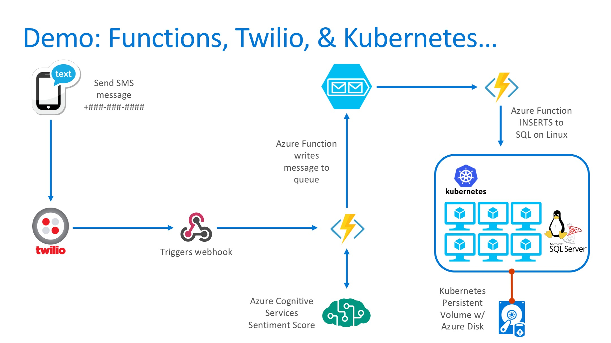

# SQL Guestbook
This is a simple SQL Server on Linux Docker example with a .NET Core web front-end.

## Demo Pre-requisites

This application combines Azure Functions with Twilio, Azure queues, and posts data to databases such as SQL Server on Linux. Kubernetes example provided. Below items must be setup in advance:

* Twilio account and setup: [Azure webhook details here](https://www.twilio.com/docs/guides/serverless-webhooks-azure-functions-and-csharp#create-a-new-azure-function-app)
* Azure storage queue
* Azure Container Services Kubernetes cluster
* Cognitive Services Account

## Setup Instructions

### Azure Functions

* Twilio trigger -> Azure Queue (fx_queuetrigger)
* Azure Queue -> SQL Server on Linux (fx_queuetosql)

### SQL Server

* Image: microsoft/mssql-server-linux
* Kuberenetes example stores databases on Persistent Volume (Azure VHD)
* Environment variables needed: 
  
  * -e 'ACCEPT_EULA=Y' 
  * -e 'SA_PASSWORD=yourpassword' 

* Create SQL DB "sql_guestbook"
* Create SQL table (table.sql)

### Web

* Simple .NET web app that displays guestbook entries
* Build using provided Dockerfile
* Container listens on port 5000
* Uses environment variables for SQL Server discovery: 

docker build -t repo/guestbook-web .

docker run -d -e "ASPNETCORE_URLS=http://+:5000" -e "SQLSERVER=sql" -e "SQL_ID=sa" -e "SQL_PWD=yourpassword" -e "SQL_DB=sql_guestbook"  --name web -p 80:5000 repo/guestbook-web